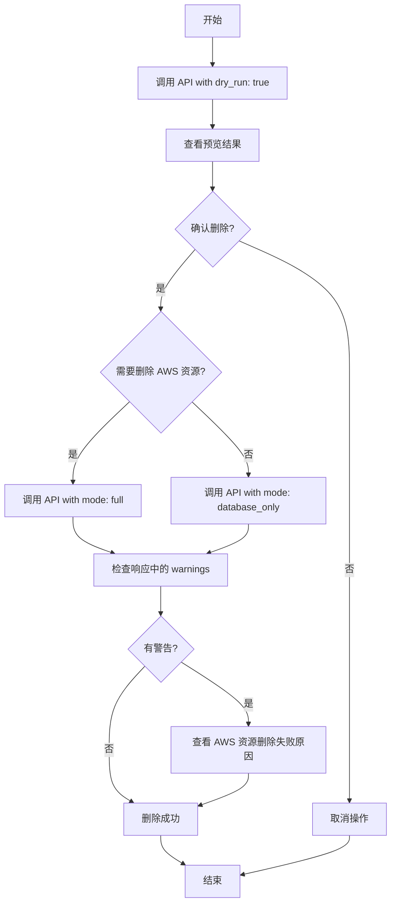

## 接口概览

**用途**: 清空所有测试设备数据（仅用于开发/测试环境）

**路径**: `/functions/v1/dev-reset-all-devices`

**方法**: `POST`

**权限要求**: 需要管理员权限（owner 或 admin 角色）

**危险等级**: ⚠️ 高危操作 - 此接口会删除所有设备相关数据

---

## 请求参数

### Request Body (JSON)

```typescript
interface ResetRequest {
  confirm: boolean;                    // 必须为 true 才能执行删除操作
  mode: 'database_only' | 'full';      // 删除模式
  dry_run?: boolean;                   // 可选：预览模式，不实际删除
}
```

#### 参数说明

| 参数名 | 类型 | 必填 | 说明 |
|--------|------|------|------|
| `confirm` | boolean | ✅ 是 | 确认标志，必须为 `true` 才会执行删除。设为 `false` 或不传会返回错误 |
| `mode` | string | ✅ 是 | 删除模式：<br/>- `database_only`: 仅清空数据库数据<br/>- `full`: 清空数据库 + 删除 AWS IoT 资源（Thing、Certificate）|
| `dry_run` | boolean | ❌ 否 | 预览模式，默认 `false`。设为 `true` 时只返回将要删除的数据统计，不实际删除 |

---

## 响应格式

### 1. Dry Run 模式响应 (dry_run: true)

```json
{
  "dry_run": true,
  "summary": {
    "total_devices": 25,
    "gateway_devices": 5,
    "child_devices": 20,
    "total_batches": 3
  },
  "devices": [
    {
      "id": "uuid-1",
      "name": "Gateway-001",
      "type": "gateway",
      "thing_name": "IoT-Gateway-000001",
      "has_certificate": true
    },
    {
      "id": "uuid-2",
      "name": "Trap-001",
      "type": "trap",
      "thing_name": null,
      "has_certificate": false
    }
  ],
  "batches": [
    {
      "id": "uuid-batch-1",
      "batch_id": "batch_1735372800"
    }
  ],
  "message": "Dry run completed. No data was deleted."
}
```

**说明**:
- `gateway_devices`: 网关设备数量（拥有独立的 AWS IoT 资源）
- `child_devices`: 子设备数量（通过网关通信，无独立 AWS IoT 资源）
- 两种设备在制造时是分开的，互相不可见

### 2. 实际删除响应 (dry_run: false 或未传)

#### 成功响应 (200)

```json
{
  "success": true,
  "message": "All devices and related data have been deleted",
  "mode": "full",
  "summary": {
    "devices_deleted": 25,
    "batches_deleted": 3,
    "aws_cleanup": {
      "attempted": 5,
      "succeeded": 5,
      "failed": 0,
      "errors": []
    }
  },
  "warnings": null,
  "performed_by": "admin@example.com",
  "timestamp": "2024-12-10T08:30:00.000Z"
}
```

#### 响应字段说明

| 字段名 | 类型 | 说明 |
|--------|------|------|
| `success` | boolean | 操作是否成功 |
| `message` | string | 操作结果消息 |
| `mode` | string | 实际执行的删除模式 |
| `summary.devices_deleted` | number | 删除的设备总数 |
| `summary.batches_deleted` | number | 删除的批次总数 |
| `summary.aws_cleanup` | object | AWS 资源清理结果（仅 `mode: 'full'` 时返回）|
| `summary.aws_cleanup.attempted` | number | 尝试删除的 AWS 资源数量 |
| `summary.aws_cleanup.succeeded` | number | 成功删除的 AWS 资源数量 |
| `summary.aws_cleanup.failed` | number | 删除失败的 AWS 资源数量 |
| `summary.aws_cleanup.errors` | string[] | 删除失败的错误信息列表 |
| `warnings` | string[] \| null | 警告信息（如部分 AWS 资源删除失败）|
| `performed_by` | string | 执行操作的管理员邮箱 |
| `timestamp` | string | 操作时间戳（ISO 8601 格式）|

---

## 错误响应

### 1. 未认证 (401)

```json
{
  "error": {
    "code": "AUTHENTICATION_ERROR",
    "message": "Missing or invalid authorization token",
    "statusCode": 401
  }
}
```

### 2. 权限不足 (403)

```json
{
  "error": {
    "code": "PERMISSION_DENIED",
    "message": "Admin role required for this operation",
    "statusCode": 403
  }
}
```

### 3. 未确认操作 (400)

```json
{
  "error": {
    "code": "VALIDATION_ERROR",
    "message": "Must set confirm=true to proceed",
    "statusCode": 400
  }
}
```

### 4. 方法不允许 (405)

```json
{
  "error": {
    "code": "VALIDATION_ERROR",
    "message": "Method not allowed",
    "statusCode": 405
  }
}
```

---

## 使用示例

### 示例 1: 预览删除（Dry Run）

**请求**:
```bash
curl -X POST https://your-project.supabase.co/functions/v1/dev-reset-all-devices \
  -H "Authorization: Bearer YOUR_JWT_TOKEN" \
  -H "Content-Type: application/json" \
  -d '{
    "confirm": true,
    "mode": "database_only",
    "dry_run": true
  }'
```

**响应**: 返回将要删除的数据统计，不实际删除

---

### 示例 2: 仅删除数据库数据

**请求**:
```bash
curl -X POST https://your-project.supabase.co/functions/v1/dev-reset-all-devices \
  -H "Authorization: Bearer YOUR_JWT_TOKEN" \
  -H "Content-Type: application/json" \
  -d '{
    "confirm": true,
    "mode": "database_only"
  }'
```

**说明**:
- 删除数据库中的所有设备、批次、激活码、遥测数据等
- **不删除** AWS IoT 资源（Thing、Certificate）
- 适用于快速清理测试数据，保留 AWS 资源

**删除的表**:
1. `device_shares` - 设备分享记录
2. `device_owners` - 设备所有权记录
3. `telemetry_last` - 遥测数据
4. `device_activation_codes` - 激活码
5. `devices` - 设备表
6. `manufacturing_batches` - 生产批次

---

### 示例 3: 完全删除（数据库 + AWS IoT）

**请求**:
```bash
curl -X POST https://your-project.supabase.co/functions/v1/dev-reset-all-devices \
  -H "Authorization: Bearer YOUR_JWT_TOKEN" \
  -H "Content-Type: application/json" \
  -d '{
    "confirm": true,
    "mode": "full"
  }'
```

**说明**:
- 删除数据库中的所有数据
- **同时删除** AWS IoT 资源：
  - 分离 Thing 和 Certificate 的关联
  - 停用 Certificate
  - 删除 Certificate
  - 删除 Thing
- 适用于完全重置测试环境

---

### 示例 4: JavaScript/TypeScript 调用

```typescript
async function resetAllDevices(
  supabaseUrl: string,
  accessToken: string,
  options: {
    mode: 'database_only' | 'full';
    dryRun?: boolean;
  }
) {
  const response = await fetch(
    `${supabaseUrl}/functions/v1/dev-reset-all-devices`,
    {
      method: 'POST',
      headers: {
        'Authorization': `Bearer ${accessToken}`,
        'Content-Type': 'application/json',
      },
      body: JSON.stringify({
        confirm: true,
        mode: options.mode,
        dry_run: options.dryRun || false,
      }),
    }
  );

  if (!response.ok) {
    const error = await response.json();
    throw new Error(error.error?.message || 'Reset failed');
  }

  return await response.json();
}

// 使用示例
try {
  // 先预览
  const preview = await resetAllDevices(
    'https://your-project.supabase.co',
    userToken,
    { mode: 'database_only', dryRun: true }
  );
  console.log('将要删除:', preview.summary);

  // 确认后执行
  const result = await resetAllDevices(
    'https://your-project.supabase.co',
    userToken,
    { mode: 'database_only', dryRun: false }
  );
  console.log('删除完成:', result);
} catch (error) {
  console.error('删除失败:', error.message);
}
```

---

## 操作流程

### 推荐工作流程



### 步骤说明

1. **预览阶段**: 先调用 `dry_run: true` 查看将要删除的数据
2. **确认阶段**: 确认无误后，选择合适的 `mode`
3. **执行阶段**: 调用实际删除接口
4. **验证阶段**: 检查响应中的 `warnings` 字段，确认是否有部分资源删除失败

---

## 注意事项

### 1. 权限要求

- 必须是管理员用户（`owner` 或 `admin` 角色）
- 使用有效的 JWT Token（通过 Supabase Auth 获取）

### 2. 删除顺序

数据库删除按依赖关系顺序执行：
1. `device_shares` (设备分享)
2. `device_owners` (设备所有权)
3. `telemetry_last` (遥测数据)
4. `device_activation_codes` (激活码)
5. `devices` (设备)
6. `manufacturing_batches` (批次)

### 3. 设备类型说明

**重要**: 在制造设备时，子设备和网关设备是分开制造的，互相不可见：
- **网关设备 (Gateway)**: 独立制造，拥有独立的 AWS IoT 资源（Thing、Certificate）
- **子设备 (Child Devices)**: 独立制造，没有独立的 AWS IoT 资源，通过网关进行通信

此接口会同时删除两种类型的设备数据。

### 4. AWS IoT 资源删除

在 `mode: 'full'` 模式下：
- 只删除网关设备 (gateway) 的 AWS 资源
- 子设备 (child devices) 没有独立的 AWS 资源，无需删除
- 删除步骤：
  1. 分离 Certificate 和 Thing
  2. 停用 Certificate
  3. 删除 Certificate
  4. 删除 Thing

### 5. 环境检查

- 接口会检测环境变量 `ENVIRONMENT`
- 在生产环境 (`production`) 会输出警告日志
- 建议在生产环境禁用此接口（代码中已预留禁用逻辑）

### 6. 错误处理

- 如果部分 AWS 资源删除失败，不会中断流程
- 失败的资源会记录在 `warnings` 字段中
- 数据库删除失败会直接返回错误，不继续执行

---

## 安全建议

### 1. 生产环境禁用

在生产环境中，建议取消注释以下代码行以禁用此功能：

```typescript
if (environment === 'production') {
  throw new AppError(ErrorCodes.PERMISSION_DENIED, 'Not allowed in production', 403);
}
```

### 2. 操作审计

接口响应中包含 `performed_by` 和 `timestamp` 字段，用于审计追踪。

建议在前端调用前：
- 显示二次确认对话框
- 记录操作日志
- 在测试环境添加明显的警告标识

### 3. 前端实现建议

```typescript
// 前端示例：二次确认对话框
async function handleResetDevices() {
  // 第一次确认
  const confirm1 = window.confirm(
    '⚠️ 警告：此操作将删除所有测试设备数据，是否继续？'
  );
  if (!confirm1) return;

  // 显示预览
  const preview = await resetAllDevices(supabaseUrl, token, {
    mode: 'database_only',
    dryRun: true,
  });

  // 第二次确认
  const confirm2 = window.confirm(
    `即将删除：\n` +
    `- 设备: ${preview.summary.total_devices} 个\n` +
    `- 批次: ${preview.summary.total_batches} 个\n\n` +
    `确认删除？此操作不可恢复！`
  );
  if (!confirm2) return;

  // 执行删除
  const result = await resetAllDevices(supabaseUrl, token, {
    mode: 'database_only',
    dryRun: false,
  });

  alert(`删除成功！共删除 ${result.summary.devices_deleted} 个设备`);
}
```

---

## 常见问题 (FAQ)

### Q1: `database_only` 和 `full` 模式有什么区别？

**A**:
- `database_only`: 只删除 Supabase 数据库中的数据，AWS IoT 资源保持不变
- `full`: 同时删除数据库数据和 AWS IoT 资源（Thing、Certificate）

推荐先使用 `database_only` 快速清理测试数据，需要完全重置时再使用 `full` 模式。

### Q2: 如果 AWS 资源删除失败怎么办？

**A**:
- AWS 资源删除失败不会中断流程
- 失败的资源会记录在响应的 `warnings` 字段中
- 数据库数据仍会被删除
- 可以手动在 AWS IoT Console 中清理残留资源

### Q3: 误删了数据能恢复吗？

**A**:
- 此操作**不可逆**，删除后无法恢复
- 建议操作前：
  1. 先使用 `dry_run: true` 预览
  2. 确认当前环境是测试环境
  3. 确保没有重要数据

### Q4: 为什么要传 `confirm: true`？

**A**:
- 这是一个安全机制，防止误操作
- 如果 `confirm` 不为 `true`，接口会返回 400 错误
- 确保调用方明确知道这是危险操作

---

## 版本历史

| 版本 | 日期 | 变更说明 |
|------|------|----------|
| v1.0 | 2024-12-10 | 初始版本，支持数据库和 AWS IoT 资源删除 |
